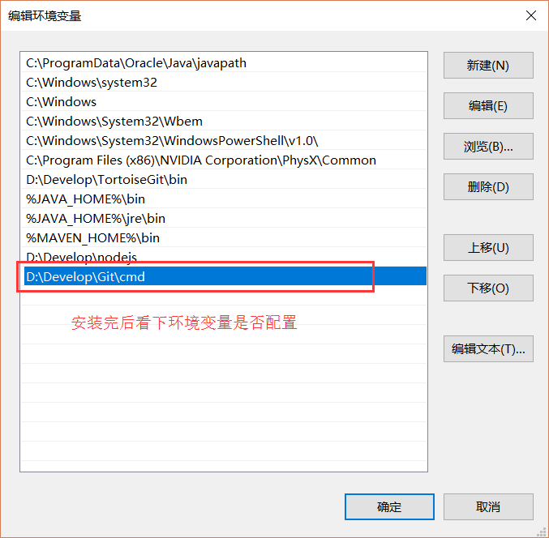

Git ：Windows系统安装
-

###### 下载安装

在[官网](https://git-scm.com/downloads)根据自己的系统下载最新的Git安装包进行安装

###### 环境变量

新版安装包安装后自动配置环境变量，可以通过在命令行输入`git --version`检查是否配置过环境变量

如果没有配置，右键点击我的电脑->属性->高级系统设置->高级页面->环境变量->系统变量中的path，配置该属性即可，如图

###### 配置用户

打开Git控制台：桌面右键->Git base here

配置用户名和邮箱（邮箱只是身份的表示，非账号）

git config --global user.name "自定义用户名"
git config --global user.email "邮箱"

取消配置

git config --global --unset user.name
git config --global --unset user.email

###### 免密提交

在Git控制台输入`ssh-keygen -t rsa -C "yourmail@gmail.com"`，会在C:\Users\用户名\.ssh目录生成公钥和私钥

> 参考文档 https://www.jianshu.com/p/a3b4f61d4747