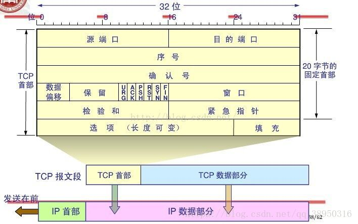
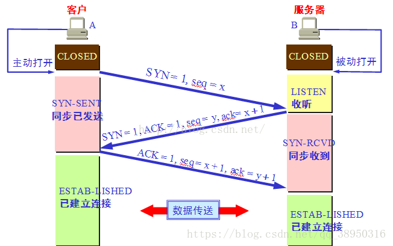
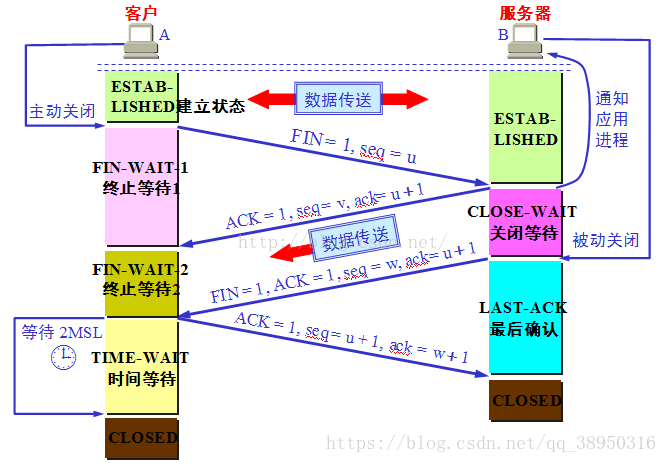

握手与挥手
-

SYN：请求建立连接

ACK：确认

FIN：请求断开连接

第一次握手：客户端发送SYN到服务器，并进入SYN_SEND状态

第二次握手：服务端收到SYN，确认SYN也发送SYN到客户端，发送SYN+ACK，进入SYN_RECV状态

第三次握手：客户端收到SYN+ACK，向服务端发送ACK，然后进入ESTABLISHED状态

1. 客户端发送FIN到服务端，并且停止发送数据，进入FIN-WAIT1状态

2. 服务端收到FIN，发送ACK，进入CLOSE-WAIT状态。此时属于半关闭状态，因为服务端数据可能没有发送完毕

3. 客户端收到ACK，进入FIN-WAIT2状态，等待服务端发送FIN

4. 服务端数据发送完毕发送FIN，进入LAST-ACK状态

5. 客户端收到FIN，发送ACK，进入TIME-WAIT状态，经过2*最长报文段寿命后，进入CLOSED状态

6. 服务端收到ACK就进入CLOSED

> https://blog.csdn.net/qq_38950316/article/details/81087809