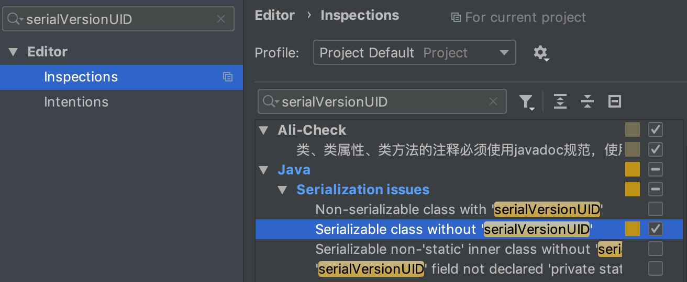

IDEA
-

###### 配置生成Java序列化id

无论哪个版本的IDEA都可以通过该方法配置

1. 打开配置面板
2. 通过搜索框搜索`serialVersionUID`
3. 左边选择`Inspections`页面
4. 右边选择`Serialization issues -> Serializable class without 'serialVersionUID'`

 

