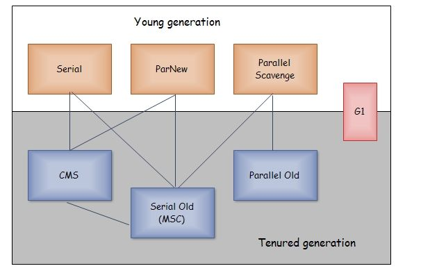

HotSpot
-

###### 回收算法优化（未完成）

###### 垃圾收集器

如果两个收集器之间有连线，表示可以搭配使用

###### Serial收集器

单线程的收集器，进行收集时会暂停其他工作线程，client模式下的默认新生代收集器

优点：简单高效

###### ParNew收集器

Serial收集器的多线程版，server模式下首选的新生代收集器，只有Serial和ParNew可以和CMS配合，使用CMS后的默认收集器

###### Parallel Scavenge收集器

其他收集器关注缩小收集时间，Parallel Scavenge收集器更关注吞吐量，可以动态调节JVM参数

###### Serial Old收集器

Serial收集器的老年代版本

###### Parallel Old收集器

Parallel Scavenge收集器的老年代版本

###### CMS收集器

Concurrent Mark Sweep。常用于B/S系统的服务端，尽量减少回收停顿时间为目标

就像名字一样，使用了标记-清除算法，收集过程如下：

- 初始标记：需要STW，仅标记GC Roots可以直接关联的对象
- 并发标记：进行GC Roots Tracing，链路追踪
- 重新标记：需要STW，修正并发标记期间，因用户程序运行导致的对象记录改变的标记记录，比初始标记长但比并发标记短
- 并发清除

耗时较长的并发标记和并发清除都可以与用户线程一起工作

优点：并发收集、低停顿

缺点：

1. 吃CPU
2. 与用户线程同时运行，因此需要留有一定的空间给用户线程，当空间不足时，引发Concurrent Mode Failure，临时使用Serial Old收集器重新收集
3. 标记-清除算法，会导致空间碎片，当空间不足时，会触发Full GC

###### G1

Garbage-First。目的是替换CMS收集器的收集器

特点：

1. 并行与并发：尽可能缩短STW时间
2. 分代收集
3. 空间整合：不存在空间碎片
4. 可预测的停顿：

保留新生代老年代的概念，具体是Region的集合，跟着每个Region，通过可预测的停顿维护一个收集优先级列表

过程如下：

- 初始标记
- 并发标记
- 最终标记
- 筛选回收

