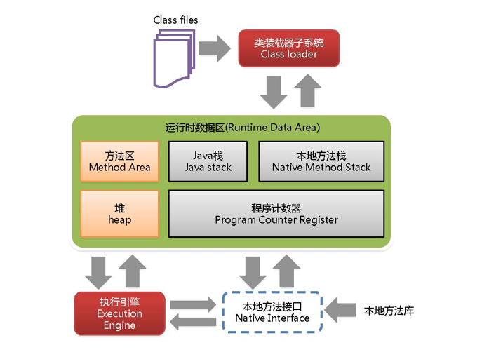
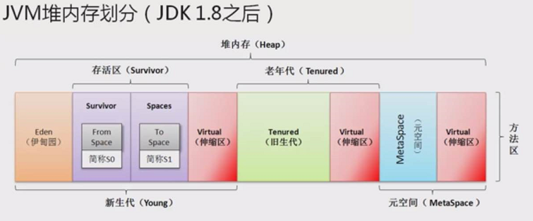

JMM
-

JMM（Java Memory Model）包含以下几个数据区域：

- 程序计数器
- 虚拟机栈
- 本地方法栈
- 堆
- 方法区

###### 程序计数器

线程私有，记录当前线程的执行状态（执行位置等），当线程切换后，可以恢复到正确的执行位置

若执行的是Java方法，记录的是虚拟机字节码指令地址；若执行的是Native方法，记录为空（Undefined）

唯一不会引起OutOfMemoryError的区域

###### 虚拟机栈

线程私有，每个方法在执行同时会创建一个栈帧，用于存储局部变量表、操作数栈、动态链接、方法出口等，方法的调用就是栈帧入栈到出栈的过程

局部变量表存放了基本类型和对象引用，long和double占用2个局部变量空间，其他占用1个，局部变量表需要的内存空间在编译期已知，运行期间不会改变大小

###### 本地方法栈

类似虚拟机栈，某些虚拟机会将虚拟机栈和本地方法栈合二为一，例如：HotSpot

###### 堆

线程共享，存放几乎所有的对象和数组，垃圾收集器管理的主要区域，也被称为GC堆

现在的收集器基本都使用分代收集算法，会将堆内存细分为以下区域：

- 新生代
	- Eden ：伊利园
	- From Survivor ：幸存区 S0
	- To Survivor ：幸存区 S1
- 老年代
- 永久代 ：JDK1.8废弃，新增元空间，不占用堆内存。[点击查看废弃原因](https://www.cnblogs.com/yulei126/p/6777323.html)

###### 方法区

线程共享，存储已加载的类信息、常量、静态变量等，其中有一块区域叫做运行时常量池

由于HotSpot使用永久代来实现方法区，很多人把方法区也叫做永久代

###### 直接内存

不属于JMM的内存区域，但是也可能引发OutOfMemoryError

JDK1.4引入了NIO（New Input/Output），可以使用Native操作堆外内存，受到本机总内存的限制