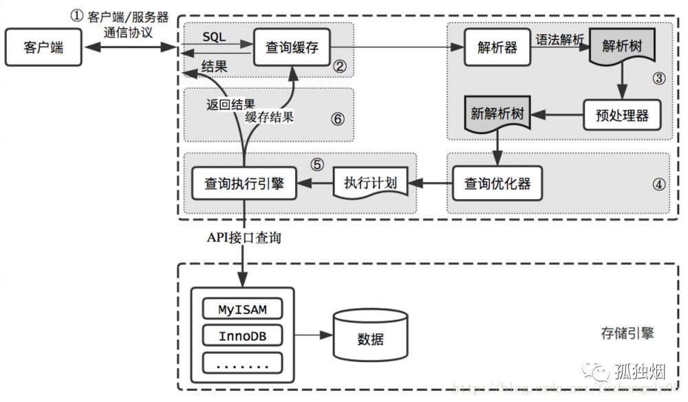

SQL 执行流程
-

执行流程图

*发送请求*

客户端安装通信协议将SQL发送至服务端，服务端会使用一个线程执行这个SQL。

通过命令`SHOW [FULL] PROCESSLIST`可以查看线程的执行状态，查询结果如下

`Command`列表示线程的执行状态

- Sleep 等待客户端请求
- Query 执行查询或发送响应给客户端
- Locked
- Sending Data

*查询缓存*

若SQL以`SELECT`开始，且符合查询缓存条件，则会查询缓存返回。

通过`SQL_NO_CACHE`可以

> 查询缓存：MySQL将执行过的语句及结果以K-V形式缓存，K是根据SQL、数据库、版本协议等生成的Hash值。8.0版本弃用
